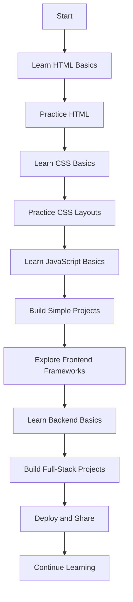

# Web Development Learning Repository

This repository is dedicated to my daily journey of learning and improving web development skills. Each day, I'll be adding new concepts, projects, or exercises covering topics such as HTML, CSS, JavaScript, frontend frameworks, backend development, and more. Stay tuned for consistent updates and progress!

---

## Table of Contents

1. [About the Project](#about-the-project)
2. [Technologies Covered](#technologies-covered)
3. [Flow Chart](#flow-chart)
4. [Prerequisites](#prerequisites)
5. [Installation](#installation)
6. [Usage](#usage)
7. [Contributing](#contributing)
8. [License](#license)

---

## About the Project

This repository is a personal log of my journey to become proficient in web development. The content includes:

- Basics of HTML, CSS, and JavaScript.
- Front-end frameworks like React.js.
- Back-end development using Node.js, Express.js, and MongoDB.
- Integration with APIs.
- Building and deploying projects.

---

## Technologies Covered

- **HTML5**
- **CSS3** (including Tailwind CSS and Bootstrap)
- **JavaScript** (ES6+ features)
- **React.js**
- **Node.js** (Express.js)
- **MongoDB**
- **Git** and **GitHub** for version control

---

## Flow Chart

Below is a flow chart outlining the typical process for learning and implementing web development concepts in this repository:



---

## Prerequisites

To get started with this repository, you will need:

- A modern web browser (e.g., Google Chrome, Firefox, Edge).
- A text editor or IDE (e.g., [Visual Studio Code](https://code.visualstudio.com/)).
- Basic knowledge of HTML, CSS, and JavaScript.

---

## Installation

1. Clone the repository:

   ```bash
   git clone https://github.com/your-username/web-development-learning.git
   cd web-development-learning
   ```

2. Open the project in your preferred text editor.

3. Open the `index.html` file in your web browser to view the project.

---

## Usage

Explore the repository to learn:

1. Basics of web development.
2. Advanced topics as updates are made.
3. Real-world project implementations.

Feel free to modify the code and experiment as you learn!

---

## Contributing

Contributions are welcome! If you'd like to share your learning journey or suggest improvements, follow these steps:

1. Fork the repository.
2. Create a new branch:

   ```bash
   git checkout -b feature/your-feature-name
   ```

3. Commit your changes:

   ```bash
   git commit -m "Add your message here"
   ```

4. Push to the branch:

   ```bash
   git push origin feature/your-feature-name
   ```

5. Open a Pull Request on the main repository.

---

## License

This project is licensed under the MIT License. See the `LICENSE` file for details.
